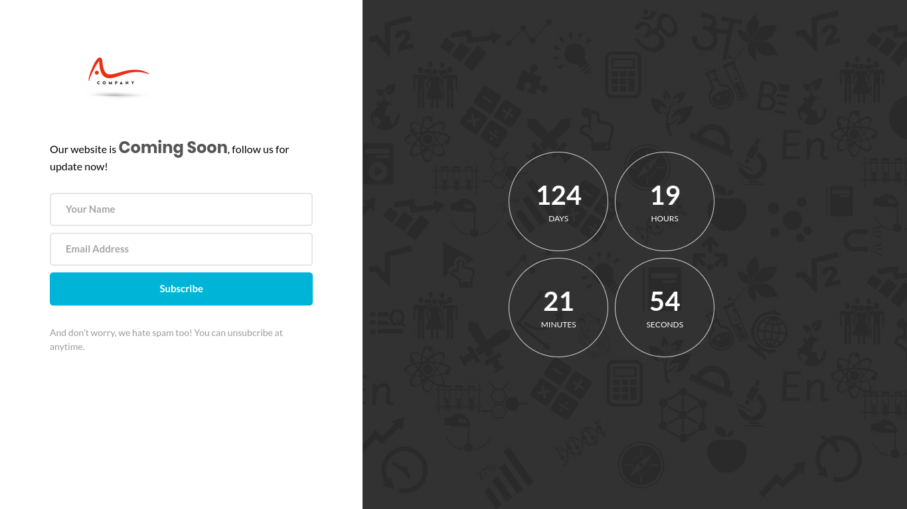

# Coming Soon Page

A simple coming soon page to inform visitors that something amazing is in the works.

## Preview

## Getting Started

To use this coming soon page:

1. Clone the repository.
2. Customize the content and design in the `index.html` and `styles.css` files.
3. Optionally, modify the countdown target date in the `main.js` file.
4. Open the `index.html` file in a web browser to see the page in action.

## Customization

You can customize the following aspects of the coming soon page:

- Text content: Update the heading and paragraph text in the `index.html` file.
- Styling: Modify the colors, fonts, and layout in the `styles.css` file.
- Countdown target date: Adjust the target date in the `script.js` file to match your desired launch date.

## License

This project is licensed under the [MIT License](LICENSE).
